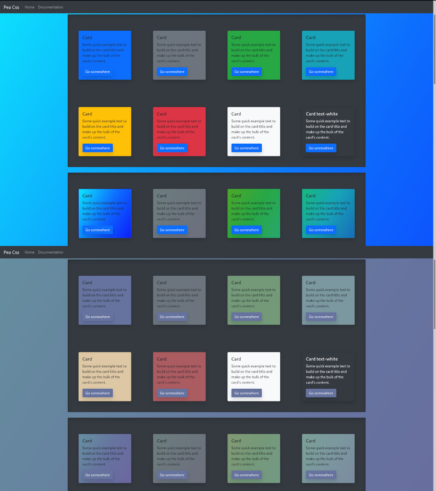

# catkin
Human Perceivable Color Manager

Catkin helps you manage color using the HSLuv color scale, a human-friendly alternative to HSL https://www.hsluv.org/

## Usage

catkin is a command-line program that reads a list of hexadecimal color codes from the stdin

See colors.txt for data file example.

```sh

cat colors.txt | catkin -s 10 # set HSLuv saturation to 10
cat colors.txt | catkin -l 10 # set HSLuv luminosity to 10

cat colors.txt | catkin -saturation 10 # set HSLuv saturation to 10
cat colors.txt | catkin -luminosity 10 # set HSLuv luminosity to 10


```

## Visual Example (before and after)

Using catkin to set saturation to 30% for all coloes in colors.txt

```sh

cat colors.txt

#0d6efd
#6610f2
#6f42c1
#d63384
#dc3545
#fd7e14
#ffc107
#28a745
#20c997
#17a2b8

cat colors.txt | catkin -s 30

#66739f
#554881
#64538e
#a1607a
#ab5c61
#c69582
#ddc7a5
#749979
#92b9a8
#7b979f


```


